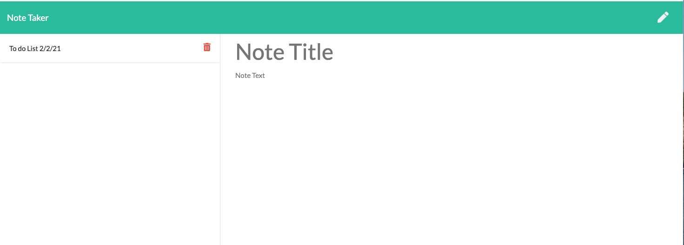

 # Note-Taker
  ## Table of Contents
  * [Description](#description)
  * [Installation](#installation)
  * [Usage](#usage)
  * [License](#license)
  * [Contributors](#contributors)
  * [Test](#test)
  * [Questions](#questions)
  
  ## Description
 Thisd app is used to write, save and delete notes. It will retrive note data from a JSON file.

  ## Installation
  Open project directory ,then npm install to install all dependencies.

  ## Usage
  1-run node server.js   
  2-open in your preferred browser http://localhost:8002   
  3-The note-Taker app is deploy in heroku -see below for link   

  ## Lincense
  

  Contact me:   
  Github: https://github.com/wendyf02   
  Email: cammomila444@gmail.com   
  Heroku Deploy link: https://hidden-ravine-43471.herokuapp.com/

Screenshot   
Let get started!!   
Click on the Get Start Button on the home page to start adding notes   

When you get to the notes page,
* On the right, you can create a new note with a title and notes within   
the description.    
* On the top right-hand corner,you can click save to automatically save    
the new note to the list on the left.   
* On left you se saved notes along with a delete icon to trash     
the note when you're done.   
 
 

Reference Resource:

https://www.npmjs.com/package/uniqid

https://www.w3schools.com/js/js_array_methods.asp

